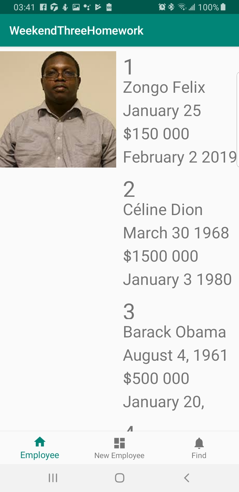
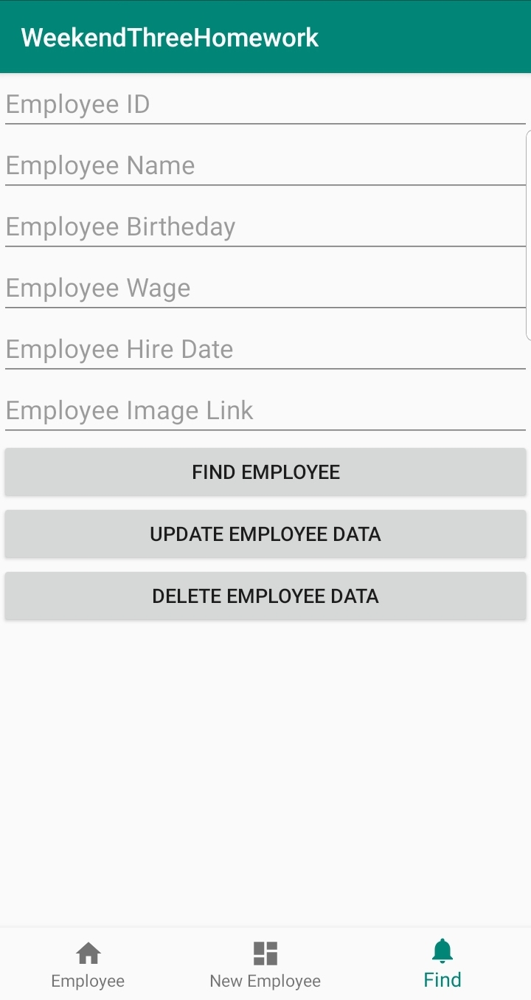
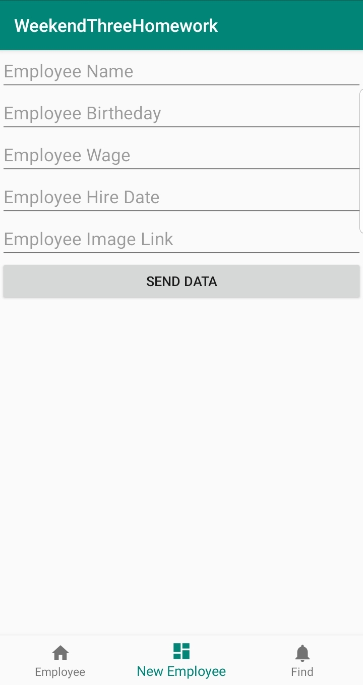

*******************************Weekend 3 Homework *******************************

1.	Create an sql database that holds the following information:
a.	employeeName
b.	employeeBirthDate
c.	employeeWage
d.	employeeHireDate
e.	employeeImage
2.	Create an application with 3 fragments
a.	First fragment will have a recycler view that will display all entries
b.	Second Fragment will insert a new employee
c.	Third Fragment will allow for finding an single employee, Updating that employee’s info, or deleting the employee
3.	Create a way to navigate between each fragment
4.	Use Glide for the images

ScreenShot1

ScreenShot2

ScreenShot3

      
